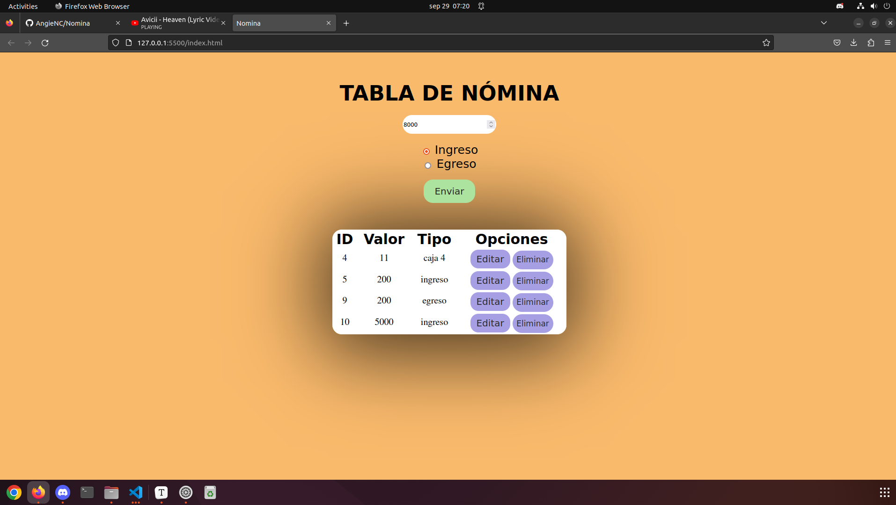
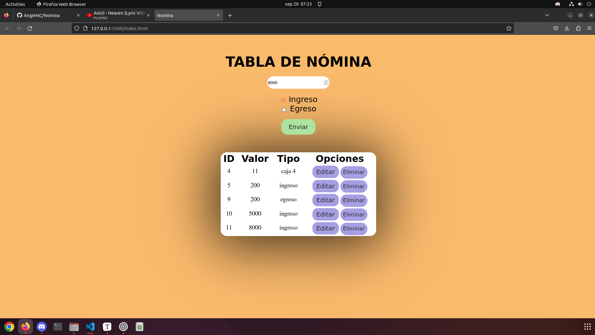
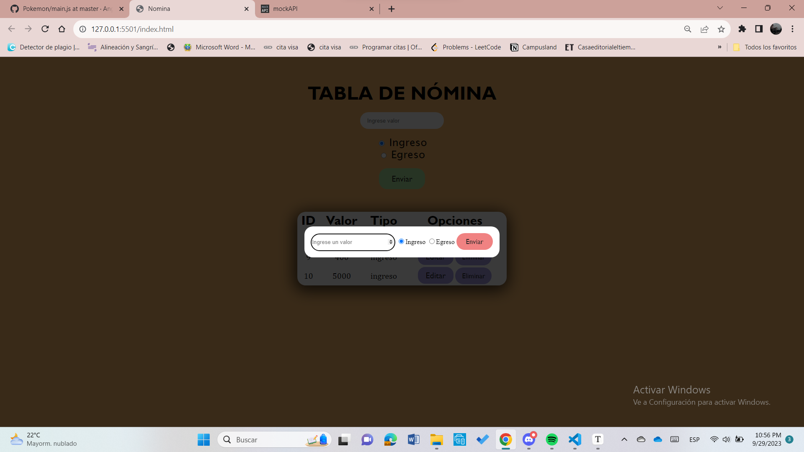

## Proyecto Nómina

Se realiza este proyecto para consumir una API de una base de datos que se almacenan en MockApi.io, y que mediante un archivo.js se crean eventos para cumplir con las solicitudes del CRUD. 

#### Tecnologías utilizadas

- JavaScript
- HTML
- MockApi.io
- CSS

#### ¿Cómo utilizar la página?

1. Puedes ingresar el valor que deseas y seleccionar si es Ingreso o Egreso, luego dale Enviar:

    

2. Una vez dado el valor y la asignación del tipo de valor, se te agrega automáticamente a la tabla de nómina:

   

3. Ahora podrás utilizar las dos funciones (Editar o Eliminar).

4. Para editar, le das al botón del mismo nombre y te va aparecer esta ventana:

   

5. Ahora podrás editar tu valor y tu tipo de valor y le das enviar.

6. Ahora para eliminar le das en su respectivo botón y se actualiza automáticamente:

    

      
##### Autora

Angie Cardenas

