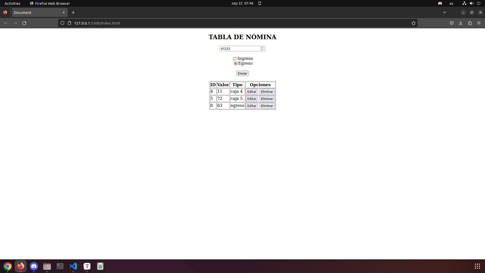

## Proyecto Nómina

Se realiza este proyecto para consumir una API de una base de datos que se almacenan en MockApi.io, y que mediante un archivo.js se crean eventos para cumplir con las solicitudes del CRUD. 

#### Tecnologías utilizadas

- JavaScript
- HTML
- MockApi.io

#### Resultado:

##### Autora

Angie Cardenas

